## 数据预处理

使用jieba提取所有标题中的分词。

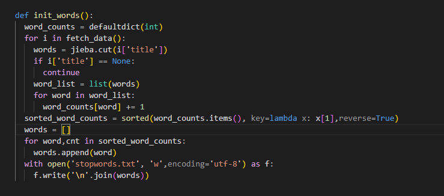

然后利用AI找出其中包含的所有公司名称

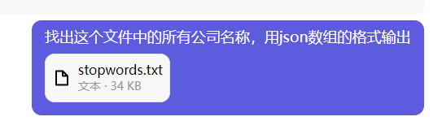

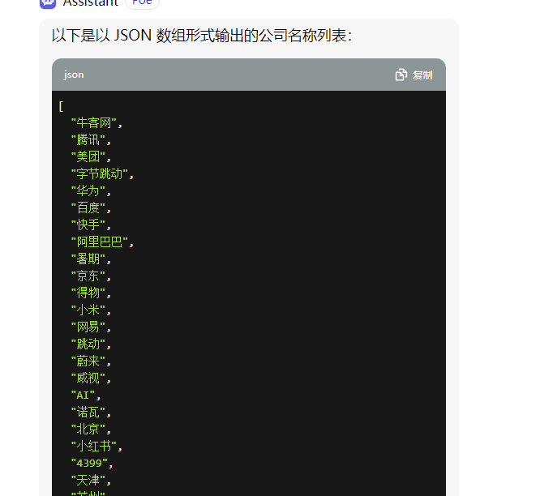

最后进行一遍手工清洗。

将公司插入数据库，并建立公司与面经之间的联系

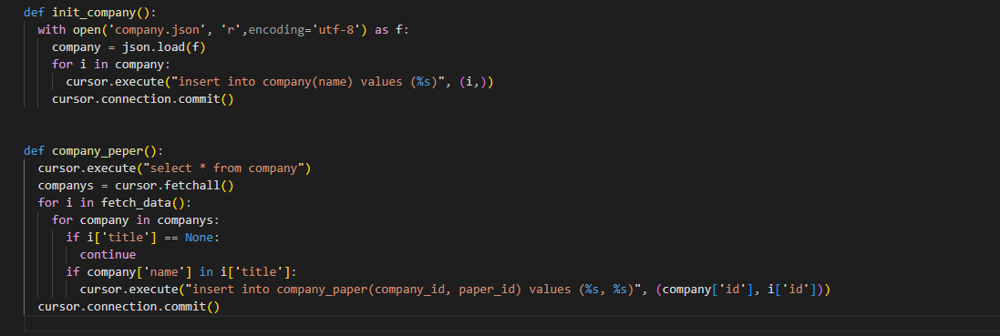


将面试类型插入到数据库

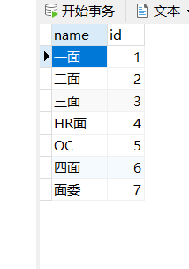

将技术栈插入到数据库

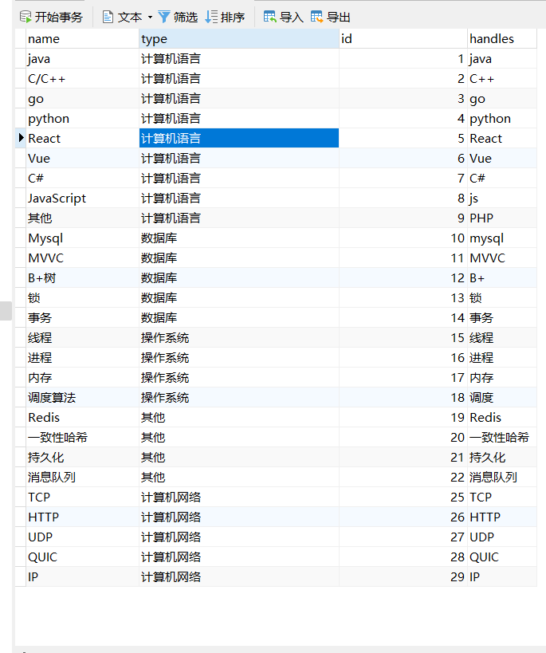

将岗位插入数据库

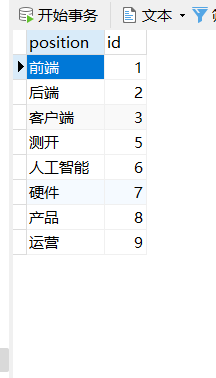

然后编写函数依次建立其与paper的联系

建立技术栈与面经之间的练习

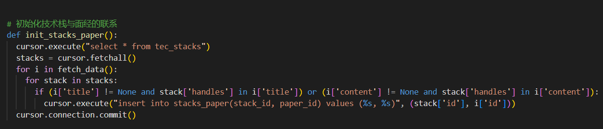

编写sql查看一下各种技术栈的出现频次，大概感受一下正确性

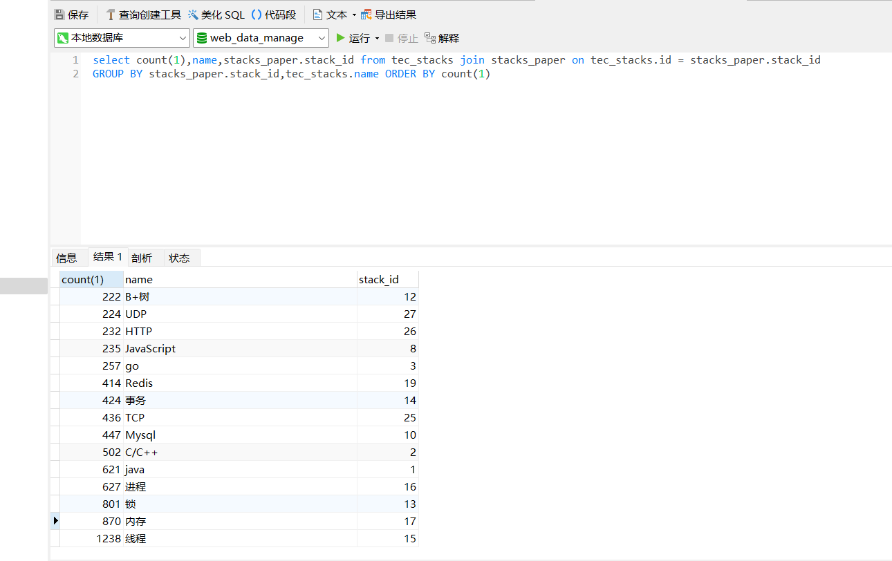

看起来没什么问题。

然后初始化面试类型与面经之间的关系

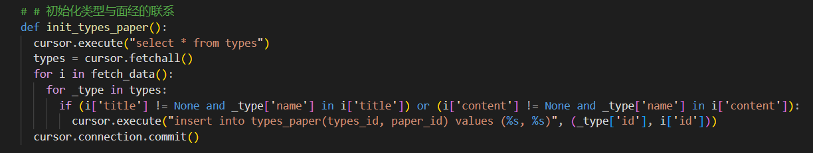

同样统计一下，直观感受一下

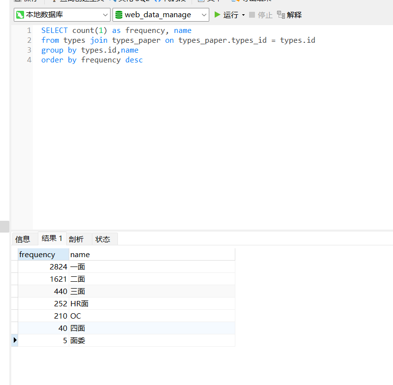


然后统计岗位与面经之间的关系，同样的统计一下看一眼

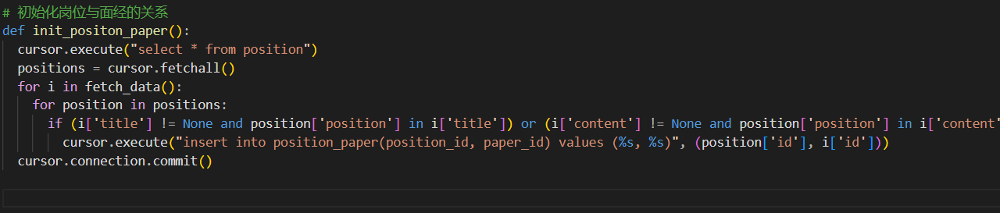

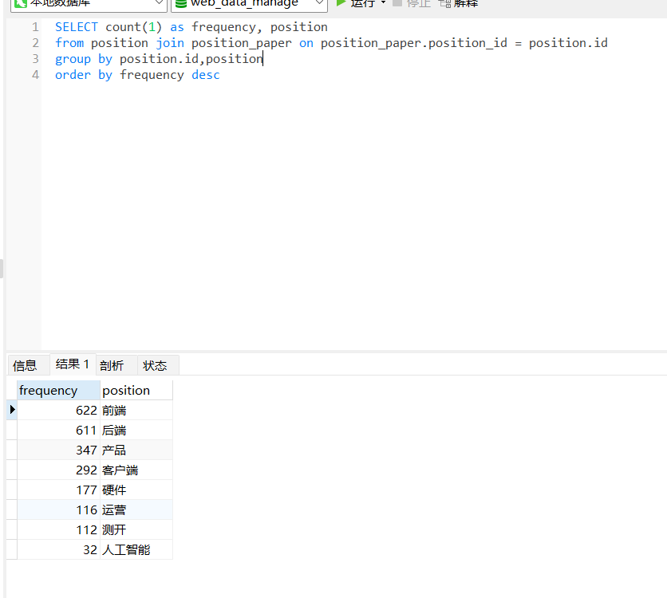

然后将四种基础统计查询以视图的形式保存到数据库中。

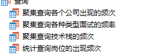

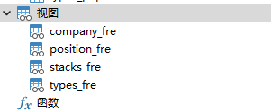


## Mapper

然后编写对应的mapper从视图中查询。

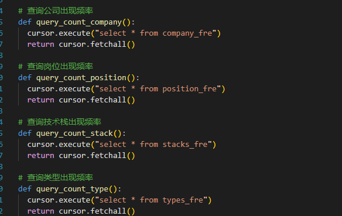

然后处理一些比较复杂点的统计

### 统计各个公司中每种面试的占比

首先各个公司中每种面试所占的数量是固定的，我们把这个先做成视图保存起来，

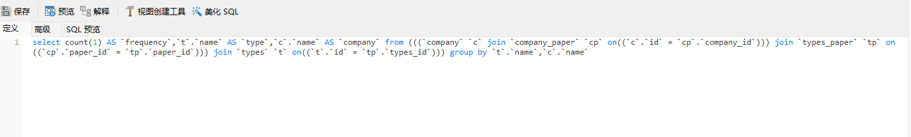

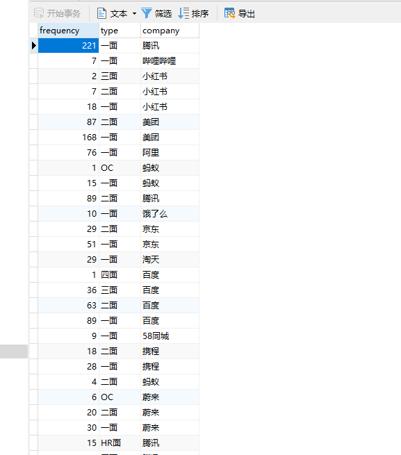

然后编写sql语句借助这个试图查询特定公司各种类型出现的频率。

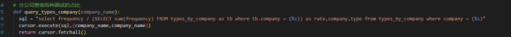

### 统计各种技术栈大类的占比

借助试图编写sql语句查询

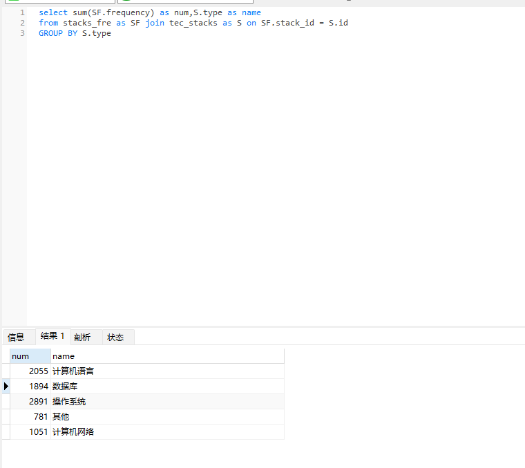

然后将此sql整合到mapper中。

###  统计各个岗位每种面试的占比

方法与统计公司中每种占比类似，不再赘述


###  统计各个岗位的各种技术栈的数量

方法与上面类似，不再赘述


###  面经检索

然后提供根据关键词检索面经，然后返回对应的title和url链接

## 搭建server

然后使用flask搭建一个后端server。

接受前端的请求，并返回从mapper得到的数据。

代码如下：

```python
from flask import Flask, request, jsonify
from mapper import query_count_company, query_count_position, query_count_stack, query_count_type, query_types_company, query_type, query_types_position, query_stacks_position, query_interviews
app = Flask(__name__)

@app.route('/count_company', methods=['GET'])
def count_company():
    return jsonify(query_count_company())

@app.route('/count_position', methods=['GET'])
def count_position():
    return jsonify(query_count_position())

@app.route('/count_stack', methods=['GET'])
def count_stack():
    return jsonify(query_count_stack())

@app.route('/count_type', methods=['GET'])
def count_type():
    return jsonify(query_count_type())

@app.route('/types_company', methods=['GET'])
def types_company():
    company_name = request.args.get('company_name')
    return jsonify(query_types_company(company_name))

@app.route('/type', methods=['GET'])
def big_type():
    return jsonify(query_type())

@app.route('/types_position', methods=['GET'])
def types_position():
    position = request.args.get('position')
    return jsonify(query_types_position(position))
@app.route('/stacks_position', methods=['GET'])
def stacks_position():
    position = request.args.get('position')
    return jsonify(query_stacks_position(position))

@app.route('/interviews', methods=['GET'])
def interviews():
    handle = request.args.get('handle')
    return jsonify(query_interviews(handle))

if __name__ == '__main__':
    app.run(port=5000)
```

使用postman测试一下

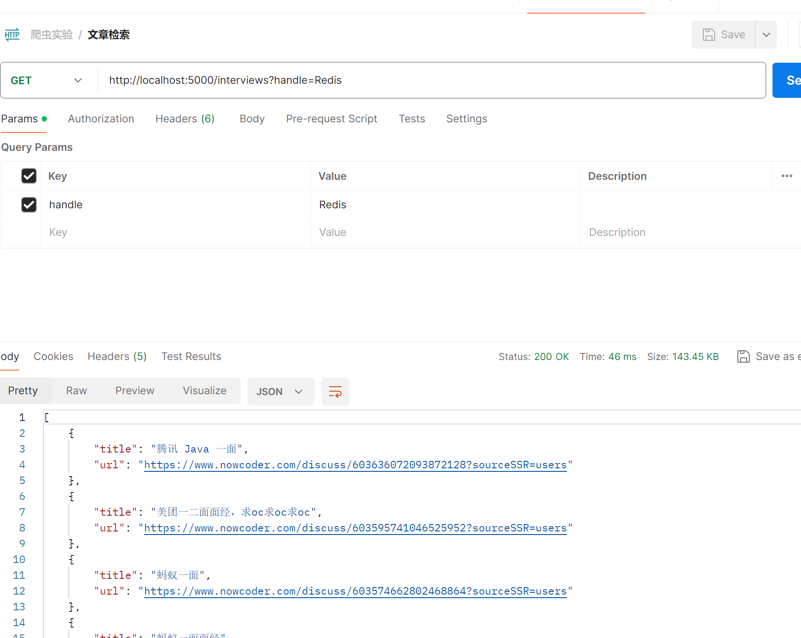

都没问题，跑的通。

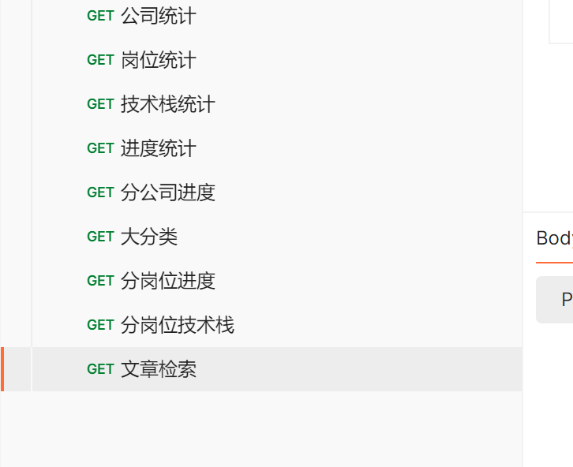

### AI智能总结

这个功能用于调用GPT的API对面经进行总结分析，使用户可以直接预览文章。

首先申请一个openai的key，后面使用这个key进行调用。

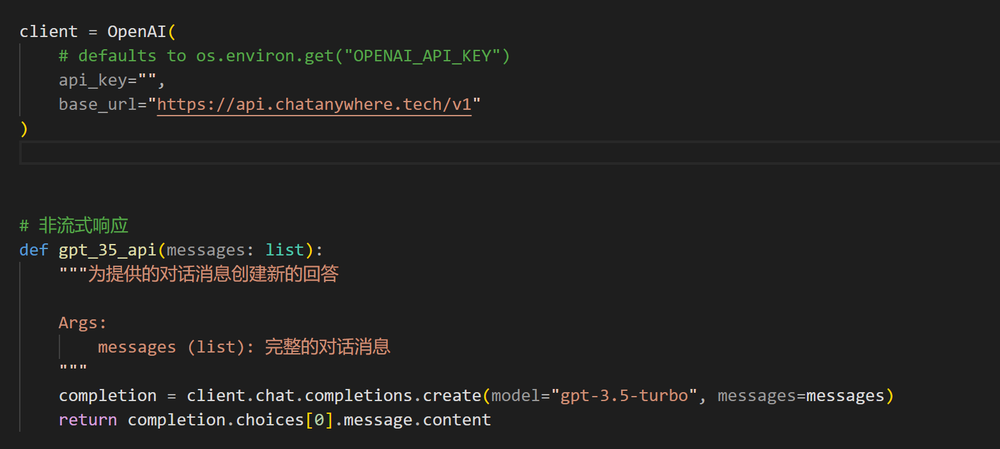

这里编写一下调用gpt的函数。

然后编写一个函数接收一个句柄，然后传给gpt进行分析。

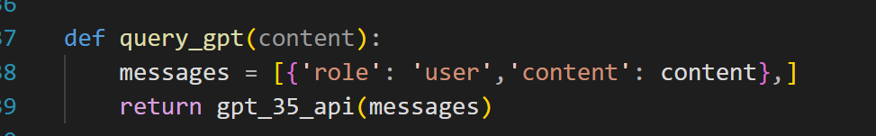

然后在mapper中根据文章id获取文章的title和内容。

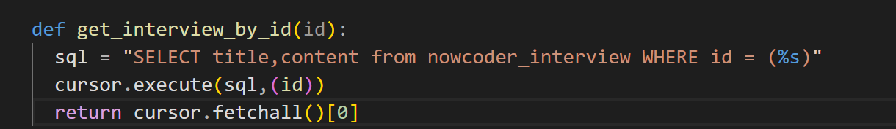

然后再controller中获取文章，交给gpt去分析然后返回结果即可。

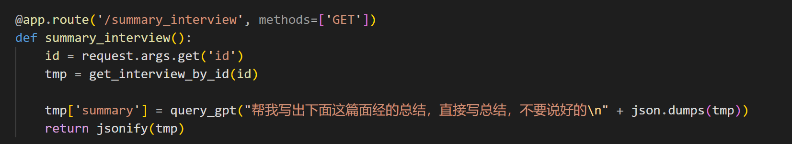

